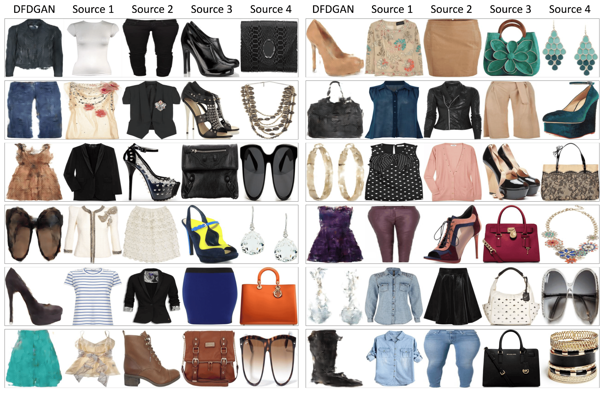

# Deep_Fashion_Designer_Generative_Adversarial_Networks_for_Fashion_Item_Generation

## Abstact

Generative adversarial networks (GANs) have demonstrated remarkable performance in various fashion-related applications, including virtual try-ons, compatible clothing recommendations, fashion editing, and the generation of fashion items. Despite this progress, limited research has addressed the specific challenge of generating a compatible fashion item with an ensemble consisting of distinct categories, such as tops, bottoms, and shoes. In response to this gap, we propose a novel GANs framework, termed Deep Fashion Designer Generative Adversarial Networks (DFDGAN), designed to address this challenge. Our model accepts a series of source images representing different fashion categories as inputs and generates a compatible fashion item, potentially from a different category. The architecture of our model comprises several key components: an encoder, a mapping network, a generator, and a discriminator. Through rigorous experimentation, we benchmark our model against existing baselines, validating the effectiveness of each architectural choice. Furthermore, qualitative results indicate that our framework successfully generates fashion items compatible with the input items, thereby advancing the field of fashion item generation.
Keywords: generative adversarial networks; fashion image synthesis; fashion compatibility

## Environment
```
conda env create -f environment.yaml
```

## Dataset and Check Point Download
```
bash dataset_down.sh && unzip outfitdata_set3.zip
```
## Test Image Generation

```
python3 main.py --config config_image_gen.yml
```
## Feature Embedding Space

```
python3 main.py --config config_ft_vis.yml
```
## Reference
